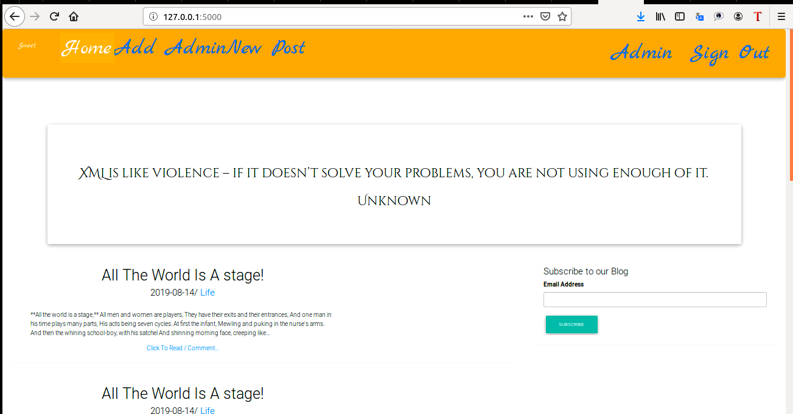
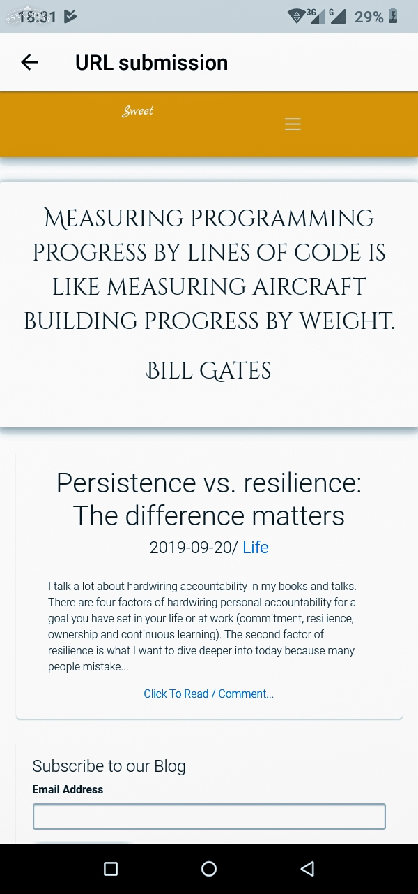

# Sweet
This is  a personal blogging website where you can create and share your opinions and other users can read and comment on them.
# Author
Joflix Ooko
# Date
12/08/2019

# Detailled Description
***** Language(s) / Technology ***** :
  * Python3.6 for scripting
  * PSQL for database
  * Quote API for displaying quotes
  * MD Bootstrap library for designing
  * HTML for markup
  * CSS for Cascading
# Versioning
  * Due to bugs, this is the second versioning =, an improvement of stunning-enigma v1.
  * This app have gone through the third versioning v2 as at 19/09/2019
  * This app have gone through the fourth versioning v3 as at 20/09/2019

  # Demo of a working page

  

  ***Ressponsivity***
  

 # Development

 ***For developers, the following can be done ***:
 1. git clone this repo using this command
 ```
 $ git clone https://github.com/JOFLIX/stunning-enigma.git

 ```
 2.Install pip3 using:
 ```
 $ sudo apt-get install python3-pip.
 ```
 3. Install virtual environment using:

 ```
 $ sudo pip3 install virtualenv
 ```
 4. Define virtual using:
 ```
 $ virtualenv virtual
 ```
 5. Activate virtual using :
 ```
 $ source virtual/bin/activate
 ```
 6. Install requirements using either:
 ``$ pip3 install -r requirements.txt,
 ```
 OR
 ```$ pip freeze >requirements.txt

 $ pip freeze
```

8. To run the application locally you can either:

```
   $ export FLASK_APP=manage.py

   $ export FLASK_ENV= development

   $ flask run
```

         OR
```
    $ python3.6 manage.py runserver
```
   ## Known bugs
   ***The server is posing some problems and I will be working on it. So take heart, and be patient, or come and visit again.***
      ***The application have shown some anamolous deprecation and breakdown.THe issue have been temporarily fixed and a solid solution is underway.***

   ## Contact:
          You are at liberty to raise an issue incase of anything amiss with the app. You can also followmw, then email me the problem.

          ## License
